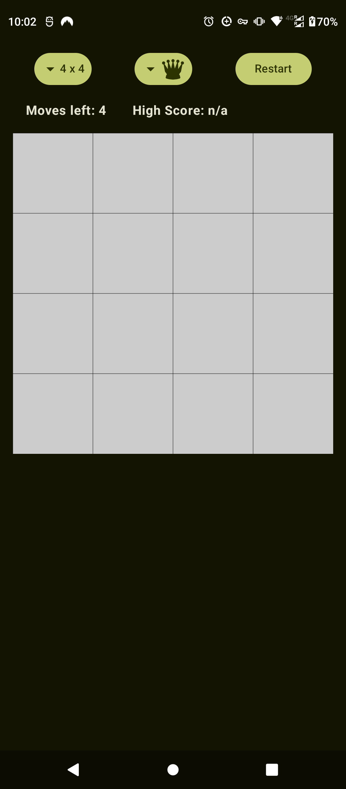
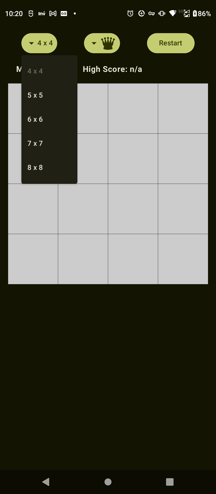
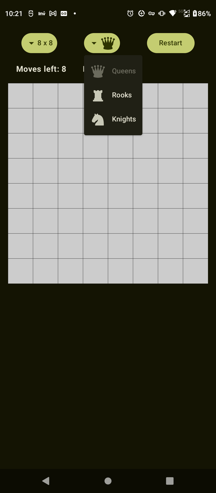

This is an Android application designed to demonstrate Jetpack Compose
using Clean Architecture design.

# The UI
The UI implements a puzzle game based on the
[N-Queens problem](https://en.wikipedia.org/wiki/Eight_queens_puzzle), 
where others chess pieces are available too.

The UI allows the user to choose the board size, the chess piece type and to restart the game.

The number of moves left, the high score (if available) and the time played is also displayed.

